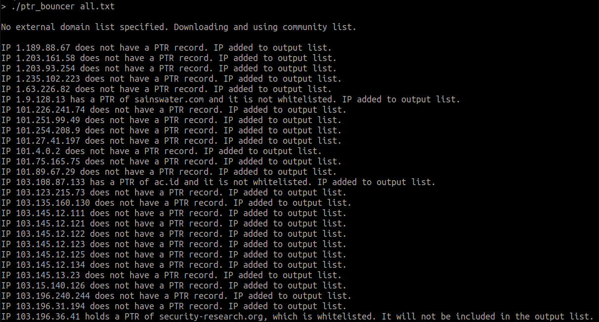

<p align="center">

# PTR Bouncer

Keeping legitimate Internet security scanners off of poor reputation IP lists. 

# What is it?

* A script - That takes a list of IP addresses and checks their corresponding PTR record against a list of legitimate Internet security scanners
* A list - A community approach to listing legitimate Internet security scanners
* A MISP Warning List - The list information in a standard MISP Warning List format

## PTR Bouncer

This script will take a list of IP addresses and output to a file the IPs for which a whitelisted second level domain name (example.com) is not found.

Basic usage:

Run the script with the project/community list: `./ptr_bouncer ips.txt`

Run `./ptr_bouncer -h` for additional options.

Sample output:



To avoid abuse in the decision process, `ptr_bouncer` requires that the PTR record matches the second-level domain (example.com). This means that if the domain **shodan.io** is whitelisted, **scanner1.shodan.io.bad.com** will not be seen as belonging to **shodan.io** while **scanner1.shodan.io** will be.

## Installation

`ptr_bouncer` will download the community list (if you choose to use it) on each run, so you can safely run it without having to keep the list updated. 

Here's a one-liner to download the script:

`curl -sSL https://raw.githubusercontent.com/3CORESec/PTRB/master/ptr_bouncer -o ./ptr_bouncer && chmod +x ptr_bouncer`

## Domain List

The SLD's of known security/research projects.

* ➡️ [PTR Bouncer - Community List](./ptrb-domains.txt)

## MISP Warning List

If you'd like to use this information in MISP, we generate a MISP [Warning List](https://github.com/MISP/misp-warninglists) out of the domains used by PTR Bouncer.

* ➡️ [Scanning Projects MISP Warning List](./MISP/scanning-projects.json)

## Helper - Removing private IP address ranges

Want to keep private IP addresses off your list?

```
sed -E -i '/(169)\.(254)(\.([2][0-5][0-5]|[1][0-9][0-9]|[1-9][0-9]|[0-9])){2}/d' your-list.txt
sed -E -i '/(192)\.(168)(\.([2][0-5][0-5]|[1][0-9][0-9]|[1-9][0-9]|[0-9])){2}/d' your-list.txt
sed -E -i '/(172)\.([1][6|7|8|9]|[2][0-9]|[3][0-1])(\.([2][0-5][0-5]|[1][0-9][0-9]|[1-9][0-9]|[0-9])){2}/d' your-list.txt
sed -E -i '/(10)(\.([2][0-5][0-5]|[1][0-9][0-9]|[1-9][0-9]|[0-9])){3}/d' your-list.txt
sed -E -i '/(127\.0\.0\.1)/d' your-list.txt
```

# Contributions

We welcome all contributions to this project, however, inclusion in the domain list goes through a manual vetting process. If we added all domains to the list it would defeat the purpose of the project. Feel free to open an issue if there's a particular project or company you'd like to see added to the lists.

# What about whitelisting IPs?

You are absolutely free to do so, however, we don't believe in this approach. It is not unrealistic to expect that a legitimate company doing mass scanning in the Internet should configure their servers with appropriate reverse DNS records. At the very least, by not supporting whitelisting through IP address, we aim to incentivize that behaviour.

A list of IPs can quickly become unmaintained and it is hard to keep updated. A PTR record, on the other hand, requires an additional validation (by configuring A record + PTR record) by the server operator.

# Feedback

This project is part of [3CORESec Blacklist](https://blacklist.3coresec.net), our honeypot community project. If you haven't yet, check it out.

Found this interesting? Have a question/comment/request? Let us know! 

Feel free to open an [issue](https://github.com/3CORESec/PTRB/issues) or ping us on [Twitter](https://twitter.com/3CORESec).

[](https://twitter.com/3CORESec)
